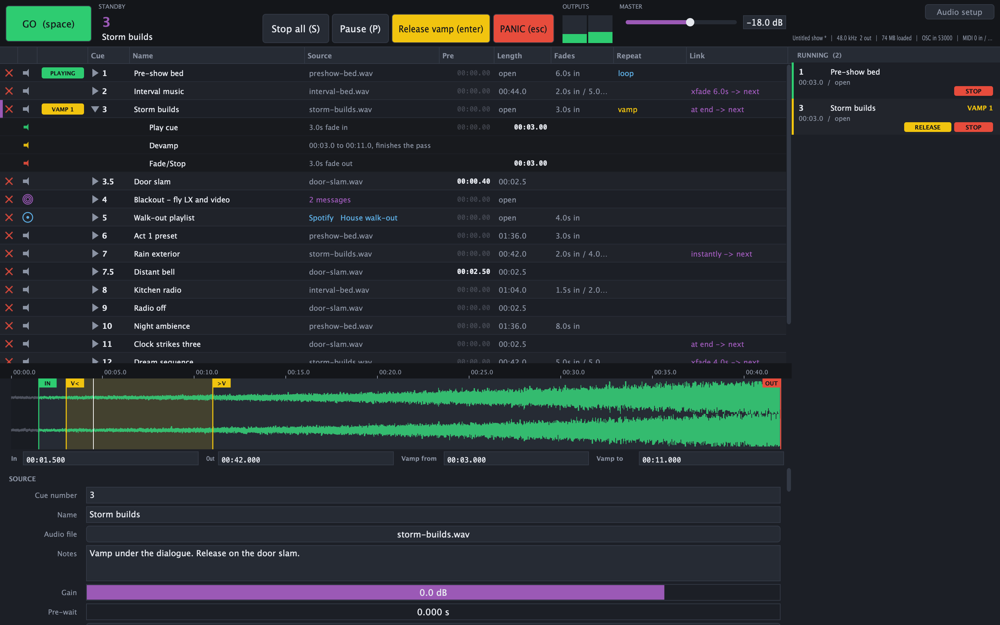
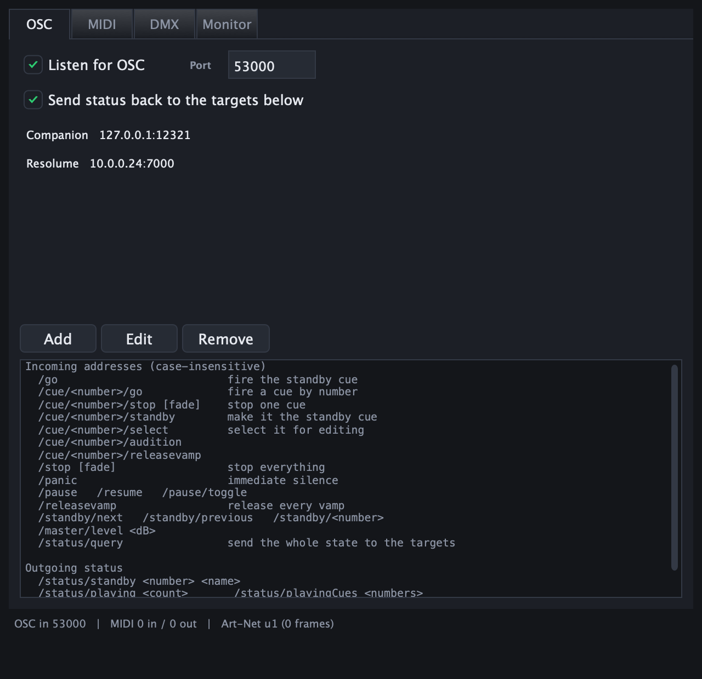
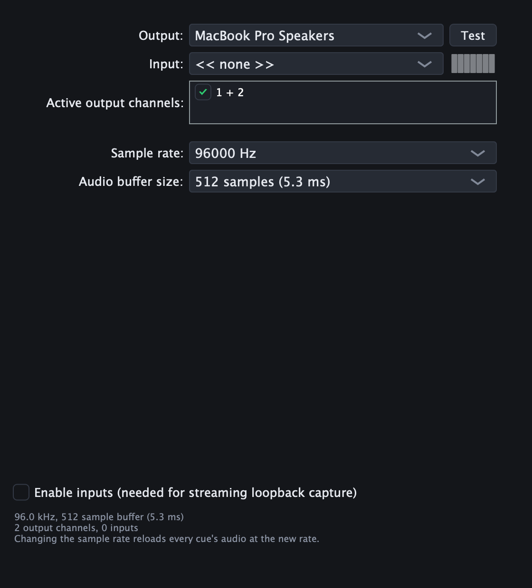

# SimpleCue

[](https://github.com/allansargeant/simplecue/actions/workflows/ci.yml)

> **AI-assisted project.** This codebase was created with [Claude Code](https://claude.com/claude-code)
> (Anthropic), directed and reviewed by a human author. The playback engine is verified
> numerically — a console harness pushes a ramp signal, whose sample values encode their own
> index, through the real `CueVoice` and checks in/out points, fades, loops, vamps, routing
> and crossfade timing sample by sample. The control layer's wire formats and mappings are
> tested the same way, and the OSC and Art-Net paths are additionally driven end-to-end over
> real sockets against a running app (304 checks, all passing). It has **not** yet been run
> on a live show; no MIDI, lighting or streaming hardware has been connected to it, and only
> the macOS/CoreAudio build has been exercised on real audio hardware.

A platform-independent audio cue player for theatre, live events and installation, built
around cues, fades, links, loops and vamps.

- **Cues** — an audio file with adjustable in and out points, gain and pre-wait.
- **Fades** — automatic fade-in and fade-out with five curve shapes.
- **Links** — how a cue hands over to the next: fire it instantly, fire it at the end, or
  crossfade into it.
- **Loops** — repeat a cue a set number of times, or forever.
- **Vamps** — circle a section of a cue until the operator calls for it to continue.
- **Cue lifecycles** — a cue expands into the steps it actually needs (play, devamp, end),
  and GO walks them one at a time.
- **Routing** — a per-cue crosspoint matrix onto any of the device's output channels.
- **Control** — trigger it from OSC, MIDI, MIDI Show Control, Art-Net or sACN, and have
  cues send MIDI and OSC out to other gear.



*Cue 3 opened to show its lifecycle — play, devamp, end — with the standby marker on the
step the next GO will perform. Cue 1 loops under the house, cue 4 is a control cue with no
audio, and the inspector shows the vamp markers on the waveform.*

## Cue lifecycles

A cue is not always a single event. A vamped cue is played, held, released, and eventually
ended, and each of those is a separate GO. So a cue expands into the steps it actually
needs, and GO walks them:

| Sub-cue | When it appears |
|---|---|
| **Play cue** | Always |
| **Devamp** | Only when the cue has a vamp to release |
| **Fade/Stop** | Always — even a cue that would end by itself can be wanted out early |

Ending is either a fade over a per-cue time or a hard stop.

Standby sits either on the cue itself or on one of its sub-cues, and the marker shows
exactly which. **Firing a cue also fires its Play sub-cue** — a per-cue checkbox, on by
default; turn it off to make the cue a container that does nothing until one of its
sub-cues is fired. Because firing the cue already played it, GO skips the Play sub-cue and
offers the next one.

Every cue shows a disclosure triangle; the standby cue opens on its own so you can see what
the next few GOs will do. Clicking a sub-cue stands it by directly, for when a rehearsal
needs to jump straight to "release this vamp".

<table>
<tr>
<td width="50%"></td>
<td width="50%"></td>
</tr>
<tr>
<td>Control setup: the OSC address scheme, MIDI bindings, MSC filtering and the DMX channel
map, with a live monitor of incoming traffic.</td>
<td>Audio setup: device, sample rate and buffer, plus the input toggle that streaming
loopback capture needs.</td>
</tr>
</table>

## Audio backends

| Platform | Backends |
|---|---|
| macOS | CoreAudio (always), JACK if its headers are installed |
| Windows | WASAPI shared, WASAPI exclusive, DirectSound, and **ASIO** when built against the SDK |
| Linux | ALSA, and JACK when its headers are installed |

PipeWire needs no backend of its own on Linux — it is reached through its ALSA and JACK
compatibility layers and appears there as an ordinary device.

### ASIO

The Steinberg ASIO SDK licence forbids redistribution, so it is not vendored here. Download
it from [Steinberg](https://www.steinberg.net/developers/) and point CMake at the unpacked
folder:

```bash
cmake -B build -DSIMPLECUE_ASIO_SDK_PATH=C:/SDKs/asiosdk_2.3.3
```

Without it, Windows builds still get WASAPI (shared and exclusive) and DirectSound.

## Building

Requires CMake 3.22+ and a C++20 compiler. JUCE 8.0.6 is fetched automatically.

```bash
cmake -B build -DCMAKE_BUILD_TYPE=Release
cmake --build build -j8
```

On Linux you will also need the usual JUCE dependencies:

```bash
sudo apt install libasound2-dev libjack-jackd2-dev libfreetype6-dev libfontconfig1-dev libx11-dev libxcomposite-dev libxcursor-dev libxext-dev libxinerama-dev libxrandr-dev libxrender-dev libcurl4-openssl-dev
```

## Running the engine tests

```bash
./build/SimpleCueTests_artefacts/Release/SimpleCueTests
```

There are also two end-to-end scripts that drive a **running** app over real UDP sockets —
see [Tests/e2e](Tests/e2e).

## Regenerating the screenshots

The images above are rendered by the app itself, offscreen through JUCE's own rasteriser,
from a demo show built in code. That means they can be regenerated from a known state after
a UI change rather than drifting out of date:

```bash
"./build/SimpleCue_artefacts/Debug/SimpleCue.app/Contents/MacOS/SimpleCue" --screenshots docs/images
```

It loads the demo show, opens each window, writes the PNGs and quits. The master level is
pinned to silence for the run, and the demo audio is synthesised rather than sampled, so
nothing plays out loud and no one's copyright is involved. Your own control settings are
left alone.

## Keyboard

| Key | Action |
|---|---|
| `Space` | GO — perform the standby step |
| `Return` | Release every vamp |
| `Esc` | PANIC — instant silence |
| `S`, or `Cmd/Ctrl` + `.` | Stop all, with a two-second fade |
| `Cmd/Ctrl` + `P` | Pause / resume |
| `'` | Audition the selected cue |
| `Cmd/Ctrl` + `Return` | Standby the selected cue |
| `Cmd/Ctrl` + `↑` / `↓` | Move the selected cue |
| `Shift` + `Cmd/Ctrl` + `↑` / `↓` | Step the standby marker |
| `Cmd/Ctrl` + `E` | Add audio cue |
| `Cmd/Ctrl` + `,` | Audio setup |
| `Shift` + `Cmd/Ctrl` + `,` | Control setup |

Drag audio files onto the window to add them as cues; drag a `.cueshow` file to open it.

## How playback works

Audio is decoded to memory and resampled to the device's rate when a cue is loaded, so
every seek, loop and vamp boundary is exact integer sample arithmetic at run time and a GO
never waits on a disk. The cost is RAM — roughly 11.5 MB per stereo minute at 48 kHz — and
the loaded total is shown in the status bar.

Links are scheduled in samples, not by a UI timer. When a cue is fired, the length of what
it will play is usually known, so the cue it links to starts immediately with a pre-wait
measured in samples, which makes auto-follows and crossfades sample-accurate. Only cues
with no determinate end — an infinite loop, an unreleased vamp, a streaming cue — fall back
to the message-thread timer, because nothing can predict when those finish.

## Control

SimpleCue can be driven from a lighting desk, a Companion page, a tablet or another
machine, and cues can send messages out to other gear.

| | |
|---|---|
| **OSC** | Fixed address scheme — `/go`, `/cue/12.5/go`, `/stop`, `/master/level` — plus a status feed back to the configured targets so Companion buttons can show what is standing by and what is playing. |
| **MIDI** | Note, CC and program-change bindings; **MIDI Show Control** (GO / STOP / RESUME / LOAD / GO_OFF / ALL_OFF, with device-ID and command-format filtering); **MIDI Machine Control**. |
| **Art-Net / sACN** | A block of DMX channels for GO, stop, panic, pause, vamp release, master level, standby select, and direct cue triggers. |
| **Outgoing** | Any cue can carry MIDI (including MSC and MMC) and OSC messages, scheduled against its pre-wait so they land with the audio rather than with the GO. A cue with messages and no audio is a **control cue**. |

Three details that matter in practice: DMX triggers are **edge-detected** (a desk sends the
same universe forty times a second), the **first frame after connecting only arms** the
detector so plugging into a desk holding GO high does not fire a cue, and **sACN preview
packets are ignored** so a designer working blind cannot fire a sound cue by accident.

Full reference, including the DMX channel map and the OSC address table:
**[docs/control.md](docs/control.md)**.

## Streaming services

SimpleCue can drive **Spotify, TIDAL, Apple Music and YouTube Music** for background music
and playlists, with an important caveat:

> **No streaming service will hand a desktop application decrypted audio.** DRM (Widevine)
> prevents it, libspotify has been dead since 2015, and the Web Playback SDK is
> browser-only. So a streaming cue never plays *through* our decoder.

Two ways to work with that, both modelled on the cue:

1. **Local capture (recommended)** — point the service's desktop app at a loopback device
   (BlackHole on macOS, VB-Cable or VoiceMeeter on Windows, a PipeWire/JACK sink on Linux)
   and open that device's inputs in SimpleCue. The audio then runs through the normal
   voice path, so fade curves, gain and the routing matrix behave exactly as they do for a
   file cue. Enable inputs in **Audio setup** first.
2. **Remote device** — the service plays on one of its own Connect devices and we send only
   transport and volume commands. Fades go through the service's volume endpoint: coarse,
   network-latent, and never touching our routing matrix.

Each service needs you to register your own developer application and supply its client ID;
Spotify Connect control also requires Premium. The provider adapters are Phase 3 — the cue
type, audio path and capture routing are modelled and persist today, and the transport hook
(`AudioEngine::streamingTransport`) is in place for them to plug into.

Whether streaming-service audio may be played to an audience is a licensing question
between you and the service (and your local performing-rights body), not a technical one.

## Status

**Phase 1** — engine, cue model, show file, cue list, inspector, waveform editor, device
selection and channel routing. Done.

**Phase 2** — control surface: OSC in and out, MIDI bindings, MSC, MMC, Art-Net, sACN,
outgoing messages on cues, control cues, and a Companion-facing status feed. Done.

**v0.2.0** — cue lifecycles (play / devamp / end, walked by GO), a Settings window holding
the streaming account and the show's new-cue fade defaults, typed exact times under the
waveform, and a stop shortcut.

Not yet built:

- **Phase 3 — streaming provider adapters.** OAuth PKCE and transport for the four services
  above.
- Disk streaming for very long files (everything is memory-resident today).
- Undo/redo.

## Licence

MIT — see [LICENSE](LICENSE).
